<div align="center">
  
</div>

<div align="center">
  <a href="https://git.io/typing-svg">
    
  </a>
</div>

<div align="center">
  
</div>

<br/>

---

## `$ whoami`

```
◈  Role     →  Backend / Full-Stack Apprentice
◈  Origin   →  Brazil 🇧🇷
◈  Focus    →  Building things that actually work
```

---

## Technologies

<div align="center">
  
</div>

---

## Statistics

<div align="center">

  
  

</div>

---
<div align="center">
  
</div>

---

## Redes Sociais

<div align="center">

[](https://www.instagram.com/llandrade__/?hl=pt)
[](mailto:seuemail@exemplo.com)
[](https://linkedin.com/in/seuusuario)

</div>

<br/>

<div align="center">
  
</div>
